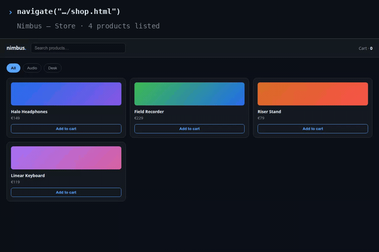
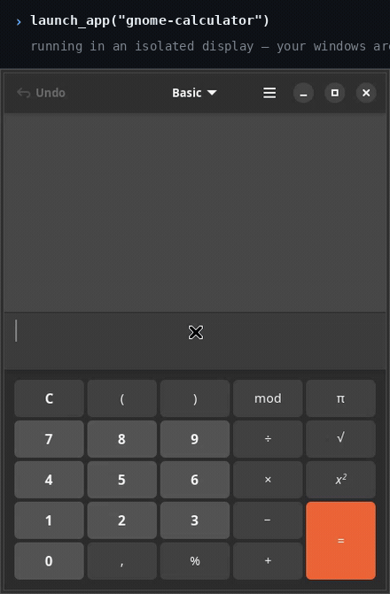

<p align="center">
  <a href="https://alanblanchet.github.io/interact/">
    
  </a>
</p>

## Repository boundaries

Interact has a public client, a shared public contracts package, and a hosted server:

- `src/interact` — the `interact` Python import, CLI, MCP server, automation, local
  sessions, and explicit API routes.
- `interact-core` — the standalone dependency-light contracts package and its generated JSON Schema,
  shared by every surface; `clients/vscode` consumes the generated TypeScript form.
- `clients/vscode` owns the VS Code extension, and `site` owns the static public website.
- `prompts/` contains distributable product defaults and their manifest. Personal prompts live in the configured account's server catalog and never enter this repository.

The hosted server consumes a released public schema version; nothing here imports it.

The public package depends on the exact public `interact-core` Git revision declared in `pyproject.toml`.
It installs without a sibling checkout. To work on both packages locally, use
`uv run --with-editable ../interact-core interact --help` from this repository.
Local-session and local-compute routes
stay distinct from separately billed `metered_api` routes; failure never silently crosses that
charge boundary, and a vendor subscription is not described as universally free.

### Prompt distribution

With a configured server, `interact prompts` reads and saves immutable personal prompt revisions
through that server. Installed provider instructions and local catalogs are rebuildable caches.
The older worktree at `${XDG_DATA_HOME:-~/.local/share}/interact/prompts` remains recovery evidence;
server-connected writes do not overwrite it. Standalone local authoring remains available when no
server is configured. `prompts/manifest.json` here defines shipped product defaults, digest-validated
before publication.
`interact.prompt_client._PromptClient.sync(account, cache)` downloads the authenticated typed catalog
and exact immutable revisions into an account-scoped `_PromptCache`. A conversation start may carry a
`PromptSelection` beside the ordinary `prompt`: the console resolves it, sends the verified content as
the provider's system instruction, and persists the server-derived `PromptExecutionRef` on `AgentRun`.
Missing, oversized, unauthorized, or mismatched revisions fail before provider startup — they never
select another prompt or charge route.

<p align="center">
  <b>Browser <i>and</i> desktop automation for AI agents — over MCP.</b><br>
  Vision-grounded control that reports <b>what changed</b>, not a screenshot.
</p>

<p align="center">
  <a href="https://alanblanchet.github.io/interact/"><b>🌐 Website</b></a> ·
  <a href="#60-second-quickstart">Quickstart</a> ·
  <a href="#install-and-connect">Install and connect</a> ·
  <a href="#ask-your-agent">Examples</a> ·
  <a href="#what-your-agent-can-do">Capabilities</a>
</p>

<p align="center">
  <a href="https://github.com/AlanBlanchet/interact/actions/workflows/ci.yml"></a>
  <a href="LICENSE"></a>
  <a href="https://www.python.org/"></a>
  <a href="https://modelcontextprotocol.io/"></a>
</p>

---

## See it work

Your agent clicks a filter, types a search, adds to a cart. Each caption is the tool call that ran
and the text that came back — that text is all your model sees.

<p align="center"></p>

The same tools drive a **real desktop app** — `launch_app` puts it in an isolated display the agent owns.

<p align="center"></p>

## 60-second quickstart

```bash
# 1. install the `interact` command (installs uv if missing)
curl -LsSf https://raw.githubusercontent.com/AlanBlanchet/interact/main/install.sh | sh
# Windows (PowerShell): powershell -ExecutionPolicy ByPass -c "irm https://raw.githubusercontent.com/AlanBlanchet/interact/main/install.ps1 | iex"

# 2. register it with Codex
interact install codex

# 3. start a fresh Codex session (or restart the IDE extension), then verify
codex mcp get interact

# 4. check keys, providers, browser, desktop
interact doctor
```

That's it — your agent can now navigate, click, type, scroll, drag, see, hear and watch.

Other hosts use the same bootstrap: `interact install claude`, `cursor`, `vscode`, `copilot`,
`windsurf`, `zed`, or `claude-desktop`.

<details>
<summary>Other install routes (Windows, no-install, VS Code)</summary>

```bash
uv tool install git+https://github.com/AlanBlanchet/interact             # any platform, without the installer
uvx --from git+https://github.com/AlanBlanchet/interact interact mcp     # run without installing
```

interact isn't on PyPI — the bare name is taken there. `interact install vscode` registers the server
with Copilot's agent mode; no extension needed.
</details>

## Install and connect

Linux and Windows. A background service keeps the computer connected: a systemd user service on
Linux, a task started at your logon on Windows (your own rights, no administrator). macOS: not yet —
`interact machine connect` in a terminal keeps it connected while it runs.

1. **Install**

   ```bash
   curl -LsSf https://raw.githubusercontent.com/AlanBlanchet/interact/main/install.sh | sh
   ```

   Windows, in PowerShell:

   ```powershell
   powershell -ExecutionPolicy ByPass -c "irm https://raw.githubusercontent.com/AlanBlanchet/interact/main/install.ps1 | iex"
   ```

   Needs only `curl` (or `wget -qO-` in its place) on Linux, nothing on Windows: it brings uv and
   Python. Run from a terminal, it goes straight on to step 2.

2. **Sign in**

   ```bash
   interact login
   ```

   It asks once for your Interact server address, opens its sign-in page, and you allow this
   computer there, then answer `y`. It prints `Connected: <this computer> is now a machine in
   <workspace>` and `Synced: <n> agents, prompts installed`: the CLI is signed in, this computer is a
   machine of your workspace (started now and at every boot), your agents and prompts are installed.

Right after, it asks once whether agents may run on this computer from the web (default no) and
in which folders under your home they may start (default none), then whether the web may continue
your editor conversations here (as a copy) and answer the approvals a session asks for (both
default no); `--agents` / `--no-agents`, `--agent-folder <name>`, `--continue-conversations` and
`--answer-approvals` answer ahead. Change it later on that computer: run `interact login` again
(already connected, it asks only these questions, Enter keeping each current answer; nothing to
restart), or `interact machine agent-roots <folder…>`, `interact machine agents on|off --continue on|off --approvals on|off`. Every folder starts hidden from
workflows, Data and agents: `interact machine places <folder under home> <level>` opens one (see,
read, write_on_review, sandbox, write); a wider level asked from the web waits until you run
`interact machine approve` on that computer. `interact machine fence on` runs agents inside an OS
fence built from those levels (Linux: bubblewrap + Landlock); without it an agent can read every
file your user can.
`interact logout` removes it from your account and stops the service. `interact machine service
status|start|stop|restart` reads or controls that service. On Windows the saved machine token and
CLI key are sealed with Windows' own encryption for your user (DPAPI) in files only you may read;
Script steps run in Python, PowerShell or cmd there (shell scripts need Linux or macOS). Codex
agents on a Windows PC need Codex's own Windows sandbox set up (`[windows] sandbox` in
`~/.codex/config.toml`); without it Codex refuses to run commands or edit files.

## Ask your agent

Plain English in, real actions out. Nothing to script — these are prompts you type to your agent.

> **"Open the store on localhost:3000, filter to Audio, add the field recorder to the cart and tell me the cart count."**
> `navigate` opens the page, then one `run_actions` batches the clicks and typing — each step reporting what changed. *(This is the browser demo above.)*

> **"Launch gnome-calculator in the sandbox and work out 7 × 6."**
> `launch_app` starts it on a display the agent owns; `run_actions` with `target="nested:Calculator"` presses the keys and reads the result back. *(This is the desktop demo above.)*

> **"Review the checkout page for visual defects, then confirm the nav has 4 tabs."**
> `review_ui` returns a severity-sorted critique, `verify_ui` answers PASS/FAIL per requirement, and `measure_ui` backs it with an exact WCAG contrast ratio — no model call, no spend.

## What your agent can do

One tool per job. The generic ones take a `target` — unset for the browser, a window title, `screen`,
`nested:<title>` for the sandbox, or `file:<path>` to analyse an image you already have.

| Tool | What it does |
| --- | --- |
| `run_actions` | The workhorse — click, type, scroll, drag, key-press, `evaluate_js`, batched in one call, each step reporting what changed. |
| `navigate` | Open a URL; returns title + visible text, or a vision answer with `query`. |
| `screenshot` | Capture a page, window or screen. Add `query` for an interpretation, `return_image` for raw pixels. |
| `get_interactive_elements` | List what's clickable as numbered `ref`s — DOM scan in the browser, vision / AT-SPI on the desktop. |
| `get_page_state` | URL, title, accessibility tree, visible text and the `ref` list. No model call. |
| `review_ui` | Find defects — a severity-sorted critique (contrast, overflow, truncation, misalignment). Pass a `reference` image to judge how a build diverges from a target. |
| `verify_ui` | Accept against your checklist — one PASS / FAIL / UNCLEAR per literal requirement, each naming the element judged. |
| `measure_ui` | Measure deterministically — exact WCAG contrast with AA/AAA, dominant colours, largest uniform band. No VLM, no spend. |
| `record` | Record a browser or desktop interaction to video, then `query` the video model about the sequence. |
| `transcribe` | Hear a local audio *or* video file — transcript back, or `query` it about the sound. |
| `launch_app` · `reset_sandbox` | Run an app in an isolated display the agent owns; tear it down again. |
| `list_desktop_windows` | List drivable targets — monitors, open windows, sandbox windows. |
| `session` · `get_logs` · `download_asset` | Browser session lifecycle, network / console logs, authenticated downloads. |
| `list_providers` · `report_issue` | What's configured, and file a bug or idea straight to the maintainers. |

### Models and keys

Visual jobs select your installed, authenticated **Claude Code session transport by
default**—including screenshot descriptions, element grounding, `review_ui` / `verify_ui`, and
sampled video/interaction analysis. Until you confirm the account settings below, each session
provider still runs and interact logs one warning per process. No API key is needed, and `session_only` prevents interact from falling through
to a metered API, but vendor CLIs can consume account-side credits after included plan usage.

To silence that warning, open Claude **Settings → Usage**, keep Usage credits disabled, ensure the
prepaid balance is zero, and turn auto-reload off ([Anthropic's usage-credit controls](https://support.claude.com/en/articles/12429409-manage-usage-credits-for-paid-claude-plans)). Anthropic's announced Agent SDK /
`claude -p` monthly-credit change was paused on June 16; `claude -p` continues to draw plan
usage limits ([Anthropic's paused-change notice](https://support.claude.com/en/articles/15036540-use-the-claude-agent-sdk-with-your-claude-plan)), but the account-side Usage-credit controls still require this guard. CLI authentication cannot verify these account settings, and a later change is a residual race interact cannot detect.
Video sessions receive ordered, timestamped frames (up to the configured frame cap; 12 by default),
rather than uploading the original clip.

The transport and spending policy are separate, explicit settings:

```bash
# Session transport, with no metered API fallback by interact.
interact config set media.backend auto               # auto | session | api
interact config set media.billing session_only       # session_only | api_allowed
interact config set media.providerOrder claude

# Only after disabling each named provider's account-side credits (silences the warning):
interact config set media.noExtraUsageConfirmedFor claude

# Optional session model pins and process timeout.
interact config set media.claudeModel <claude-model>
interact config set media.timeout 120
```

Without that attestation, sessions still run and warn once per process. To opt into metered
visual fallback, set `media.billing=api_allowed` and keep `media.backend=auto`; set `media.backend=api` to use only
the API. An explicit model override must belong to the selected provider—it is never silently
ignored.

Audio is the deliberate boundary: Claude visual sessions do not transcribe or hear audio.
With `session_only`, `transcribe` fails before any API call. With
`media.billing=api_allowed`, audio always uses the configured `audio.model` API or local-compatible
transport, even when `media.backend=session`; after a transcription-only model produces text, a
Claude session may answer questions over that transcript.

Run `interact status` to see the media backend, billing policy, ordered CLI availability, API/local
models, and usage. Run `interact` with no arguments for the terminal configuration UI. Settings live
in `~/.interact/config.env` and are also exposed by the VS Code extension.

## Platform support

| | Linux | macOS | Windows |
| --- | :-: | :-: | :-: |
| Browser, MCP server, CLI, TUI | ✅ | ✅ | ✅ |
| Install one-liner, `interact login`, background machine | ✅ (systemd user service) | ✅ install; the machine runs in a terminal (no background service yet) | ✅ (task at logon) |
| Script steps | Python, shell, PowerShell if `pwsh` is installed | Python, shell, PowerShell if `pwsh` is installed | Python, PowerShell, cmd |
| Desktop control (real windows) | ✅ (X11; uinput input also on Wayland) | ⏳ | ⏳ |

Browser automation works everywhere. Native desktop control is Linux/X11 today; off Linux the desktop
tools return one clear message pointing you at the browser target — macOS/Windows backends are tracked
in [#24](https://github.com/AlanBlanchet/interact/issues/24). Known X11 limits, all under
[#1](https://github.com/AlanBlanchet/interact/issues/1): GPU-rendered windows (emulators, games) grab
black without a compositor — interact says so rather than handing back a black image; a software-GL blur
can composite to a solid strip; transient popups need `target="nested"` to capture the whole sandbox.

## Development

```bash
git clone https://github.com/AlanBlanchet/interact && cd interact
uv sync
uv run pytest -m "not integration"      # fast, cross-platform suite
uv tool install --force --editable .    # put your checkout's `interact` on PATH
```

When an MCP process is already serving your editor, preserve its environment. Build the public
and core wheels, then install a separate runtime and switch future CLI/MCP launches:

```sh
python scripts/install_runtime.py --public-wheel /absolute/path/interact.whl --core-wheel /absolute/path/interact_core.whl
```

The installer verifies package metadata and import location, retains the previous environment,
and records its former launcher target. Activation briefly removes the launcher link before
creating its replacement; a concurrent replacement is preserved. Running MCP connections keep their loaded code until
you reconnect them; the installer does not reload the editor.

CI runs the suite on Linux/macOS/Windows plus a sandboxed Linux desktop job; on push to `main` it tags
and publishes the release from `pyproject.toml`'s version (see [RELEASING.md](RELEASING.md)).

## Contributing

Issues and PRs welcome. Please add a failing test for a bug before fixing it, keep the suite green
(`uv run pytest -m "not integration"`), and note user-facing changes in [CHANGELOG.md](CHANGELOG.md).

## License

[MIT](LICENSE) © Alan Blanchet

## Server-owned agent definitions

A configured launcher reads agent definitions, model criteria, reasoning effort, tool bindings
and exact prompt revisions from the server. Local snapshots and generated skill files are
replaceable caches. Transport failures may use a previously verified snapshot with a visible
`STALE` notice; authentication or workspace refusal disables cached access.

To connect an existing loopback preview, including an SSH tunnel to a remote server:

```bash
interact agents sync --endpoint http://127.0.0.1:8817 --preview
interact agents definitions codex
```

For the existing token authentication path, pass `--token-file /absolute/private/token-file`
in place of `--preview` and select `--workspace WORKSPACE_UUID`. The token file must satisfy
the existing private-file checks. Remote origins require HTTPS; preview login is loopback only.
Connection settings, private session cookies and catalog content are stored separately.

A parent's delegated capability pins an exact child revision. Use `--delegate CAPABILITY`
with `--parent-run-id RUN_UUID`, or an explicit `--agent-id UUID --agent-revision UUID`.
The launcher retrieves historical agent and prompt records when needed, verifies their identity
and digest, and never substitutes a newer head for a missing pin. Continuations retain the
original selected revision. Server-side edits appear on the next sync or launch.

Without a configured server catalog, existing local role policy and definitions remain available.

## Run workflows from scripts

A server workflow can be one step of your own script: start it, wait for its end, continue with
its outputs. Both entry points use the connection made by `interact agents sync` (preview session
or workspace API key token file).

From a shell — progress goes to stderr, the result JSON to stdout:

```bash
summary=$(interact workflows run "Write a report" --input topic=Q3 --download ./out) || exit
echo "$summary" | jq -r .outputs.answer
```

| exit | meaning |
| :-: | --- |
| 0 | run succeeded (with `--detach`: run accepted) |
| 1 | run ended failed, cancelled or interrupted |
| 2 | run could not be started, followed or its files saved (unknown workflow, refused, inputs rejected, unreachable, `--timeout`, file digest mismatch, a different file already there without `--overwrite`) |
| 130 | Ctrl-C: the CLI stopped waiting, the run goes on (`interact workflows wait RUN_ID`) |

`--input name=value` repeats (the value is JSON when it parses, text otherwise); `--input-json
FILE` (`-` for stdin) passes an object. `--detach` returns at once; `interact workflows wait
RUN_ID` follows that run later. `--idempotency-key KEY` makes a retried script get back the run
that key already started. See `interact workflows run --help`.

From Python:

```python
from interact.client import Client

run = Client().workflows.run("Write a report", inputs={"topic": "Q3"})
print(run.outputs["answer"])          # raises WorkflowRunFailed unless the run succeeded
run.download("report", "./out")       # a file output, saved under its path, sha256-checked

started = Client().workflows.start("Write a report")   # returns once accepted
for event in started.stream():                          # events until the run ends
    print(started.describe(event))
```

`AsyncClient` has the same methods for asyncio code (`await client.workflows.run(...)`,
`async for event in run.stream()`). A workflow is named by its exact name or, when several share a
name, its id.

## Portable tool preferences

Signed-in clients share account preferences through the server. `interact config status` reports
the source and revision; `interact config sync` refreshes the verified cache. The web Account page,
TUI and VS Code settings use the same values. Connected writes require the revision the editor
loaded, so another device's update produces a conflict instead of being overwritten.

Portable fields cover model selection, capture dimensions, media limits and action waiting.
Provider credentials, billing consent and device paths retain their existing local setup.
An existing local override is not silently imported: review `interact config import-preview`
before explicitly applying its selected values. Authentication refusal invalidates cached access;
a transport failure can expose a verified same-account snapshot marked stale.
